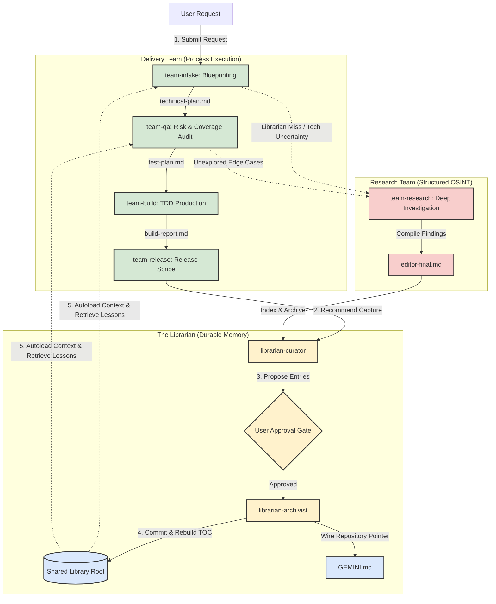

# Syntropy: Virtual Consulting, Software Delivery, & Knowledge Capitalization Suite

Syntropy is an agentic orchestration suite that automates software delivery pipelines and capitalizes execution memory recursively into a shared project knowledge base.

---

## Systems Architecture

The project is split into three decoupled plugins to keep process execution, memory, and structured research isolated:

1. **`delivery-team-plugin`**: The *Process Framework* (Triage $\rightarrow$ QA Mapping $\rightarrow$ TDD Implementation $\rightarrow$ Scribing $\rightarrow$ Status Auditing).
2. **`librarian-plugin`**: The *Durable Memory* (Shared library, Table of Contents indexer, and auto-load context wiring).
3. **`research-team-plugin`**: The *Research Team* (Deep OSINT research, verification synthesis, and bibliography builder).

---

## Detailed Workflow



### Integrated Knowledge Loop (Self-Improving):
* **Knowledge Retrieval**: During `team-intake` and `team-qa`, the planners check the Librarian's Table of Contents to pull in established architectural guidelines, local repository patterns, and lessons learned.
* **Research Trigger**: If triage or planning hits a blind spot (new technology, library, or API missing from the Librarian TOC), the team triggers `team-research` to investigate and archive the structured findings (`editor-final.md`) back into the Librarian's shared memory.
* **Knowledge Capture**: After a release is cut via `team-release`, you run the `librarian` in `capture` mode to document any new lessons, codebase idiosyncrasies, or environment quirks resolved during implementation.

---

## Prerequisites

- **Python 3.8+** (Required for scripting support and workspace verification).
- **Git** (Required for linking files and managing per-effort build worktrees).

---

## Installation by AI Harness

### 1. Gemini CLI / Antigravity (2.0)
Gemini CLI utilizes JSON-manifest extensions. You can install extensions in link mode:
```bash
# Link delivery-team-plugin
gemini extensions link ./delivery-team-plugin/delivery-team-plugin

# Link librarian-plugin
gemini extensions link ./librarian-plugin/librarian-plugin

# Link research-team-plugin
gemini extensions link ./research-team-plugin/research-team-plugin
```

### 2. Claude Code
Claude Code loads instructions from your local profile configurations. Run the installer script or copy the files directly:
```bash
# Create target directories
mkdir -p ~/.claude/skills ~/.claude/agents

# Copy skills
cp -R */*/skills/* ~/.claude/skills/

# Copy agent definitions
cp -R */*/agents/* ~/.claude/agents/
```

### 3. Cursor / Custom IDE Agents
The Windows installer mirrors skills/agents into `~/.cursor/skills` and `~/.cursor/agents`, and writes `.cursor/rules/syntropy.mdc`. You can also point a workspace ruleset at the plugin folders:
```markdown
# Cursor Rules Reference
Load instructions from:
- ./delivery-team-plugin/delivery-team-plugin/skills/
- ./librarian-plugin/librarian-plugin/skills/
- ./research-team-plugin/research-team-plugin/skills/
```

---

## Installation by Operating System

We provide automated platform installers in the root folder that auto-detect your active AI harness and configure directory paths.

### Windows (PowerShell)
Execute the PowerShell installer script:
```powershell
powershell -ExecutionPolicy Bypass -File .\install-windows.ps1
```

### macOS & Linux (Bash)
Execute the Bash installer script:
```bash
chmod +x install-mac-linux.sh
./install-mac-linux.sh
```
